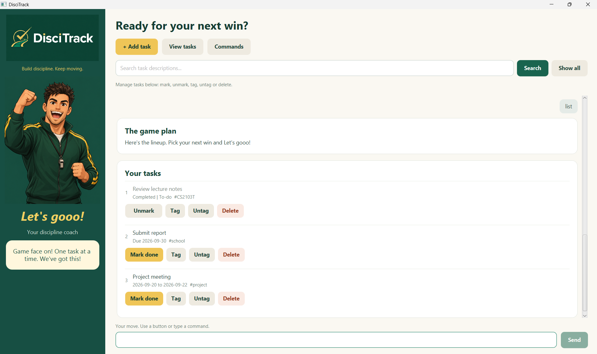

# DisciTrack User Guide

DisciTrack is a desktop task manager with a motivational coach personality. It helps you organise todos,
deadlines, and events, then keeps you moving as you complete them.



## Quick start

1. Open DisciTrack. Your saved tasks appear automatically.
2. Type a command in the box at the bottom and press **Enter** or click **Send**.
3. Start with `todo Review lecture notes` to add a task.
4. Click **View tasks** or type `list` to see the full task board.
5. Use the buttons beside a task, or type commands such as `mark 1` and `delete 1`.

Click **Commands** at any time to see command examples inside the app.

## Using the GUI

- **+ Add task** opens a form for creating a todo, deadline, or event.
- **View tasks** restores the full task list after a search or another action.
- The **search bar** finds tasks whose descriptions contain your keyword. Search ignores capitalisation.
- **Mark done**, **Unmark**, **Tag**, **Untag**, and **Delete** act on the task shown in that row.
- The command box supports every feature listed below. Invalid input stays in the box so you can correct it.

## Command summary

Dates use the `yyyy-MM-dd` format, such as `2026-09-30`. Words written in uppercase below are values you
replace; do not type the uppercase placeholder itself.

| Action | Format | Example |
| --- | --- | --- |
| Add a todo | `todo DESCRIPTION` | `todo Review lecture notes` |
| Add a deadline | `deadline DESCRIPTION /by DATE` | `deadline Submit report /by 2026-09-30` |
| Add an event | `event DESCRIPTION /from DATE /to DATE` | `event Project meeting /from 2026-09-20 /to 2026-09-22` |
| Show all tasks | `list` | `list` |
| Mark a task done | `mark NUMBER` | `mark 2` |
| Mark a task not done | `unmark NUMBER` | `unmark 2` |
| Delete a task | `delete NUMBER` | `delete 2` |
| Search descriptions | `find KEYWORD` | `find report` |
| Find tasks on a date | `checkdate DATE` | `checkdate 2026-09-30` |
| Add a tag | `tag NUMBER TAG` | `tag 2 school` |
| Remove a tag | `untag NUMBER TAG` | `untag 2 school` |
| Show command help | `help` | `help` |
| Exit | `bye` | `bye` |

## Adding tasks

### Todo

Use a todo for an activity without a specific date:

```text
todo Buy groceries
```

### Deadline

Use a deadline for work that must be completed by a date:

```text
deadline Submit project report /by 2026-09-30
```

### Event

Use an event for an activity that takes place across a date range. The start and end may be the same day,
but the end cannot be earlier than the start.

```text
event Project meeting /from 2026-09-20 /to 2026-09-22
```

Past dates and tasks with the same description are allowed.

## Organising tasks with tags

Tags are short labels such as `school`, `CS2103T`, or `project_2`. They appear beside tasks throughout the app.

Add one or more tags while creating a task by placing them at the end:

```text
todo Prepare slides /tag CS2103T /tag school
deadline Submit report /by 2026-10-01 /tag CS2103T
event Team retreat /from 2026-10-03 /to 2026-10-04 /tag work
```

Add or remove one tag later using the task's number:

```text
tag 2 urgent
untag 2 urgent
```

A tag must:

- contain 1–30 English letters, digits, hyphens, or underscores;
- start with a letter or digit; and
- contain no spaces, commas, quotation marks, pipes, or `#` prefix.

Tag matching ignores capitalisation, so `School` and `school` count as the same tag on one task. A task can
have several tags, and different tasks can share a tag.

## Finding tasks

Search task descriptions with the search bar or the `find` command:

```text
find report
```

`find` ignores capitalisation and searches descriptions only. It does not search tags.

Find deadlines due on a date and events that include that date with:

```text
checkdate 2026-09-30
```

Search results retain their numbers from the full task list. For example, results numbered 3 and 7 still use
`mark 3` and `mark 7`. Click **Show all**, click **View tasks**, or type `list` to restore the full list.

## Understanding task numbers

Task numbers are their current positions in the full list; they are not permanent IDs. Deleting a task shifts
the numbers after it. Check the current numbers with **View tasks** or `list` before changing a task.

Commands that change tasks accept one number at a time. For example, `mark 1 2` marks neither task and shows
the correct format.

## Correcting input errors

DisciTrack highlights errors and explains what needs correction. For example:

- `todo` asks for a task description.
- `deadline Submit report` asks for `/by` and a date.
- `event Camp /from 2026-09-30` asks for `/to` and an end date.
- `deadline Report /by 2026-02-30` asks for a real date.
- `mark two` asks for a whole-number task number.
- An unknown command suggests typing `help` or clicking **Commands**.

For typed commands, the invalid input remains in the command box so you can edit and resubmit it. Use the **×**
button in the command box when you prefer to start again. An invalid **Add task** form also remains open with its
values preserved.

Extra spaces and tabs between command parts are accepted. `list`, `help`, and `bye` take no additional arguments.

## Saving and recovery

DisciTrack saves every successful add, mark, unmark, delete, tag, and untag automatically. Saved tasks load the
next time the app starts. The data file is `data/discitrack.txt` relative to the folder where DisciTrack runs.

If saving fails, DisciTrack keeps the task list unchanged and tells you to check that the data folder is writable
and has free space. Try the command again after fixing the problem.

If the saved file is missing, DisciTrack starts with an empty list. If an existing file is unreadable or contains
invalid data, DisciTrack identifies the affected line and disables task-changing commands to avoid overwriting your
data. Repair the indicated line and restart the app; `help` and `bye` remain available while loading is blocked.

## Command constraints at a glance

- Descriptions cannot contain line breaks or the storage separator ` | `.
- Use `/by`, `/from`, and `/to` exactly once in their respective commands.
- Put every `/tag TAG` pair after the description and any date fields.
- Marking an already completed task or unmarking an incomplete task makes no change.
- Adding an existing tag or removing a missing tag makes no change.

When in doubt, type `help` or click **Commands** for examples.
